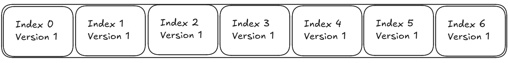
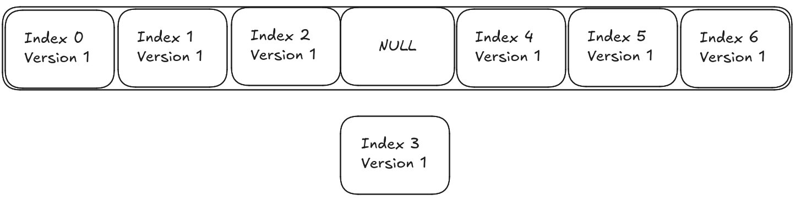

# Entity Component System

Our ecs is mostly based on the incredible blog by skypjack https://github.com/skypjack  
Named ecs back and forth https://skypjack.github.io/2019-02-14-ecs-baf-part-1/

### Entity Storage

#### Entity memory layout

Entities are by default size_t but can be any integral type.
They are a bitmask of their version and their index inside the array wich they are stored.  
Dont worry we'll go over entity versions in the next part.

```
[N bits][ 4 bits]
[index ][version]
```

You can retrieve the version like this

```C++
int version = entity & OxF;
```

You can retrieve the index like this

```C++
int index = entity >> 4;
```

#### Entity creation and deletion

We'll start from the end for this one, imagine you have a vector full of entities



If you want to keep the paradigm of entities ids = index you must
insert a null entity when erasing one



Then when someone wants to create a new entity we just have to create one a the first null spot.

However a smart trick we can use to avoir having to iterate over our array when trying to create new entities is to create an implicit linked list.  

Let's introduce a new value wich is the implicit head, it's just an entity.
When we erase an entity now we just swap it from the implicit head wich is null by default.
So after first deletion
